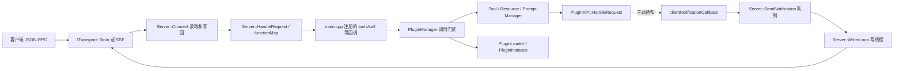

# MCP Server 源码学习导读

这份导读只看 `mcp_server/`，建议按“入口 → 协议分发 → 传输 → 插件 → 通知”的顺序读。先用 STDIO 跑通一次 `tools/list` 和 `tools/call`，再看 SSE；这样能把协议处理逻辑与网络细节分开理解。后续学习 `mcp_client`、`MCPToolManager` 和 Agent 层时，可以把这里的 JSON-RPC 请求/响应当作双方的边界。

## 一张图看层级



`Server` 负责协议分发和并发写出，不负责具体工具计算；`ITransport` 负责收发字节，不判断 `tools/call` 的语义；插件负责工具的定义与执行。`main.cpp` 是把这几层装配起来的地方。

## 目录与核心对象

| 位置 | 应重点理解的对象 | 职责 |
| --- | --- | --- |
| [`src/main.cpp`](../mcp_server/src/main.cpp) | `main`、`clientNotificationCallback` | 解析参数、初始化日志、装配 PluginManager、注册回调和 SIGHUP 标志检查 |
| [`src/server/Server.h`](../mcp_server/src/server/Server.h)、[`Server.cpp`](../mcp_server/src/server/Server.cpp) | `vx::mcp::Server` | `functionMap` 方法路由、请求处理、响应写出、通知队列与写线程、停止流程 |
| [`src/interface/ITransport.h`](../mcp_server/src/interface/ITransport.h) | `vx::ITransport` | `Start/Stop`、`Read/Write`、异步接口的抽象边界 |
| [`src/transport/StdioTransport.cpp`](../mcp_server/src/transport/StdioTransport.cpp) | `vx::transport::Stdio` | 从标准输入逐行读取 JSON，在标准输出逐行写回 |
| [`src/transport/SseTransport.cpp`](../mcp_server/src/transport/SseTransport.cpp) | `vx::transport::SSE` | HTTP `/sse` 事件流、`/messages` 请求入口，以及传给 `Server` 的收发队列 |
| [`src/loader/PluginsLoader.h`](../mcp_server/src/loader/PluginsLoader.h)、[`PluginsLoader.cpp`](../mcp_server/src/loader/PluginsLoader.cpp) | `PluginLoader`、`PluginInstance` | 扫描动态库，管理 `dlopen/dlsym/dlclose`、Create/Destroy 和 PluginAPI 生命周期 |
| [`src/manager/PluginManager.h`](../mcp_server/src/manager/PluginManager.h)、[`PluginManager.cpp`](../mcp_server/src/manager/PluginManager.cpp) | `PluginManager` | 全量加载/重载、活动调用计数、reload 门禁和通知系统装配 |
| [`src/manager/PluginRegistries.h`](../mcp_server/src/manager/PluginRegistries.h)、[`PluginRegistries.cpp`](../mcp_server/src/manager/PluginRegistries.cpp) | `ToolManager`、`ResourceManager`、`PromptManager` | 保存从插件复制出的协议元数据，并定位请求对应的 PluginAPI |
| [`src/interface/PluginAPI.h`](../mcp_server/src/interface/PluginAPI.h) | `PluginAPI`、`PluginTool`、`NotificationSystem` | 主程序与动态库之间的函数指针接口和数据结构 |
| [`src/utils/MCPBuilder.h`](../mcp_server/src/utils/MCPBuilder.h) | `MCPBuilder` | 构造 JSON-RPC 响应、错误、文本内容与通知 |
| [`plugins/calculator/Calculator.cpp`](../mcp_server/plugins/calculator/Calculator.cpp)、[`plugins/notification/Notification.cpp`](../mcp_server/plugins/notification/Notification.cpp) | 示例插件 | 前者适合学习普通工具调用，后者适合学习服务端主动通知 |

构建入口是 [`mcp_server/CMakeLists.txt`](../mcp_server/CMakeLists.txt)：编译 `mcp_server` 可执行文件，并为 6 个示例插件分别建立共享库目标。`include/` 中的 `json.hpp`、`httplib.h`、`popl.hpp` 等是本模块使用的第三方头文件。`HttpStreamTransport` 虽编进可执行文件，但 `main` 当前没有选择它，而且部分方法仍是空实现；学习运行路径时先跳过。

## 1. `main()`：按实际执行顺序追启动流程

你给出的五步抓住了主线。对照当前代码，还要注意对象创建和日志初始化的确切位置：

1. **解析参数并初始化日志。** `main()` 用 `popl::OptionParser` 解析 `--plugins/-p`、`--logs/-l`、`--sse/-s`、`--name/-n`、`--verbose/-v`。默认插件目录是 `./plugins`，日志目录是 `./logs`。
2. **选择传输。** 指定 `-s` 时创建 `shared_ptr<SSE>`；否则创建 `shared_ptr<Stdio>`。两者向上都以 `shared_ptr<ITransport>` 传给 `Server`。
3. **创建并加载 PluginManager。** PluginLoader 递归寻找平台共享库，获取 `CreatePlugin` / `DestroyPlugin`，调用 `Initialize()`；PluginManager 再把插件注册到 Tool/Resource/Prompt Manager，并装配通知回调。
4. **注册协议方法。** `main()` 用 `OverrideCallback` 将工具、资源和提示的六个方法转给 PluginManager。`initialize`、`ping` 等仍走 `Server.cpp` 默认处理函数。
5. **注册 SIGHUP。** signal handler 只设置 `sig_atomic_t` 标志；Server 的 condition-variable 重载检查线程在正常上下文中定期调用 `CheckReloadRequest()`，发现标志后执行 `reloadAll()`。
6. **进入运行循环。** `server->Connect(transport)` 在当前线程中运行到传输结束或停止，返回后 PluginManager 执行最终 shutdown。

`OverrideCallback` 只会替换 `functionMap` 中**已经存在**的方法；它不是任意新增方法的注册接口。各回调捕获共享的 PluginManager，使注册表和动态库生命周期覆盖整个 Server 运行期。

## 2. `Server.cpp`：请求与响应主线

重点按 [`Server::Connect`](../mcp_server/src/server/Server.cpp) → `Server::HandleRequest` → `functionMap` 中对应函数的顺序读。

```text
Connect(transport)
  ├─ 保存 transport_，启动 WriterLoop 线程
  ├─ transport_->Start()
  └─ while (!isStopping_)
       ├─ transport->Read()                 // 当前线程等一条消息
       ├─ json::parse(json_string)
       ├─ HandleRequest(request)
       │    └─ functionMap[request["method"]](request)
       └─ 若返回非 null：锁 output_mutex_，transport_->Write(response.dump())
```

`Connect()` 的“同步”是指**请求处理主循环**：它一次读取、分发并写回一条请求；不是说整个服务器只有一个线程。构造函数给 `functionMap` 填好 `initialize`、`ping`、工具/资源/提示方法和若干客户端通知方法。`HandleRequest()` 先检查 `method`，再查表调用；找不到时构造 JSON-RPC 错误。返回 `nullptr` 的处理函数不会写响应，这用于 `notifications/initialized` 等通知消息。

`ConnectAsync()` 是另一条实现：它启动 reader 线程，使用 `ReadAsync()` 取消息；**当前 `main()` 未使用**，初学时可以放在 `Connect()` 之后再读。`Stop()` 负责停传输、唤醒并 join 写线程和可能存在的读线程。

以工具调用为例，建议跟一遍这条具体路径：

```json
{"jsonrpc":"2.0","id":"calc-1","method":"tools/call","params":{"name":"calculator","arguments":{"expression":"1+2"}}}
```

`Connect()` 解析它，`HandleRequest()` 通过 `functionMap["tools/call"]` 进入 PluginManager。调用门禁先等待可能存在的 reload 结束并增加 `active_calls`，ToolManager 再按名称找到注册项，最终调用对应 `PluginAPI::HandleRequest`。RAII guard 在返回时减少 `active_calls`。`tools/list` 从注册表读取已复制的元数据，不直接遍历动态库。

## 3. `PluginLoader`、`PluginManager` 与 `PluginAPI`

每个 `PluginInstance` 同时拥有动态库路径、handle、`PluginAPI*`、`DestroyPlugin` 和通知系统。加载步骤是 `dlopen(RTLD_NOW | RTLD_LOCAL)`（Windows 为 `LoadLibrary`）→ `dlsym` 获取 Create/Destroy → `CreatePlugin()` → 校验函数指针 → `Initialize()`。卸载严格按 `Shutdown()` → `DestroyPlugin()` → `dlclose()`，关闭动态库后不再访问任何插件函数指针。

`PluginAPI` 不是一个有虚函数的 C++ 基类，而是包含 `GetName`、`GetType`、`GetToolCount`、`GetTool`、`HandleRequest` 等函数指针的结构体。学习插件可先看 `Calculator.cpp`：`PluginTool` 数组定义工具名称、描述和 JSON Schema，`CreatePlugin()` 返回该模块的 `PluginAPI`，`HandleRequest` 再根据请求里的 `params.name` 与 `params.arguments` 执行运算。

注意插件 `HandleRequest` 返回的是分配出来的 `char*`；PluginManager 在读取结果后用 `delete[]` 释放。写新插件时需遵守这项内存约定。更详细的插件开发说明见 [插件开发文档](mcp-plugin-development.md)。

### SIGHUP 全量热重载

reload 使用 `mutex + condition_variable` 协调 `reloading` 和 `active_calls`：

```text
reloading=true
  → 阻止新插件调用
  → 等 active_calls==0
  → 清空 Tool/Resource/Prompt 注册表
  → Shutdown → DestroyPlugin → dlclose
  → 重新扫描、dlopen、CreatePlugin、Initialize
  → 重新注册
  → reloading=false → notify_all
```

单个动态库加载失败会记录并跳过，不会结束 Server。本版本不做增量 reload、双版本、RCU 或自动回滚。

## 4. `WriterLoop`：服务端主动通知

函数名是 **`WriterLoop`**，与同步处理 RPC 的 `Connect()` 分工如下：

```text
插件（例如 logging_test / progress_test）
  → notifications->SendToClient(...)
  → main.cpp: clientNotificationCallback(...)
  → Server::SendNotification(...) 把 JSON 字符串放入 notification_queue_
  → queue_cv_ 唤醒 WriterLoop
  → WriterLoop 调用 transport_->Write(...)
  → 客户端收到不带 id 的通知
```

`WriterLoop` 是 `Connect()` 启动的**独立写线程**，不负责处理请求。`SendNotification` 在队列锁内复制通知字符串，随后唤醒写线程；响应的直接写入和通知的写入都使用 `output_mutex_`，以免同一传输的输出互相穿插。通知可在插件执行期间先于该次工具调用的最终响应到达；客户端应按是否有 `id` 区分通知与响应。`plugins/notification/Notification.cpp` 的 `logging_test` 和 `progress_test` 是最直观的阅读例子，其中后者会在执行过程中多次发进度通知。

不要把两个方向的“通知”混为一谈：客户端发来的 `notifications/initialized` 等消息走 `Connect()`/`HandleRequest()`，通常不产生响应；插件主动发给客户端的通知则走上面的 `SendNotification()`/`WriterLoop` 队列。

## 5. 两种实际可选的传输

- **STDIO：** `Stdio::Read()` 从 `stdin` 读一行，`Stdio::Write()` 往 `stdout` 写一行 JSON。`Start()`/`Stop()` 基本不做事。建议先用它理解协议，因为没有 HTTP 会话细节。
- **SSE：** `SSE::Start()` 在另一线程监听 `127.0.0.1:8080`。`GET /sse` 建立持续的事件流；`POST /messages` 把请求放入传输层的 `incoming_messages_`；`SSE::Read()` 将其交给同一个 `Server::Connect()`；`SSE::Write()` 将响应/通知放进 `outgoing_messages_`，由 `/sse` 的内容提供器推给客户端。`GET /health` 可用于检查监听是否启动。它仍是“HTTP 负责收发、Server 负责协议分发”的分层。

当前 C++ 客户端的 SSE 连接还有超时问题，服务端 SSE 基础握手与 `initialize` 已单独验证；请勿据此推断 C++ 客户端 SSE 已可用。复现步骤和已知限制见 [项目现状报告](../PROJECT_STATUS_2026-09-14.md)。

## 建议的逐文件阅读路线

1. `main.cpp`：先找 PluginManager 创建、六个 `OverrideCallback`、SIGHUP reload-check callback 和最后的 `Connect()`。
2. `ITransport.h` 与 `StdioTransport.{h,cpp}`：明确 `Read/Write` 的边界和一行一个 JSON 的传输形式。
3. `Server.h` 与 `Server.cpp` 的构造函数、`Connect()`、`HandleRequest()`：跟踪一条 `tools/list`，再跟踪一条 `tools/call`。
4. 顺着 `PluginManager`、`PluginRegistries`、`PluginLoader` 进入 `Calculator.cpp`，再阅读 `reloadAll()`。
5. 看 `Notification.cpp`、`clientNotificationCallback`、`SendNotification()`、`WriterLoop()`，理解为什么响应与通知会从不同线程写出。
6. 最后读 `SseTransport.cpp` 和未在入口使用的 `ConnectAsync()`；把它们与已经理解的 STDIO 路径逐项对照。

阅读时可随时问四个问题：**谁拥有对象？谁读取请求？谁决定调用哪个方法或插件？谁写出最终消息？** 沿着这四条线索，`Server`、传输层和插件层的职责会比较清楚。

本导读描述当前源码，并不表示所有分支已完整实现。尤其 `HttpStreamTransport` 尚未接入入口，STDIO 输入结束后的退出阶段仍存在已记录的 `SIGABRT`；这些现状不妨碍先理解主请求链路。
